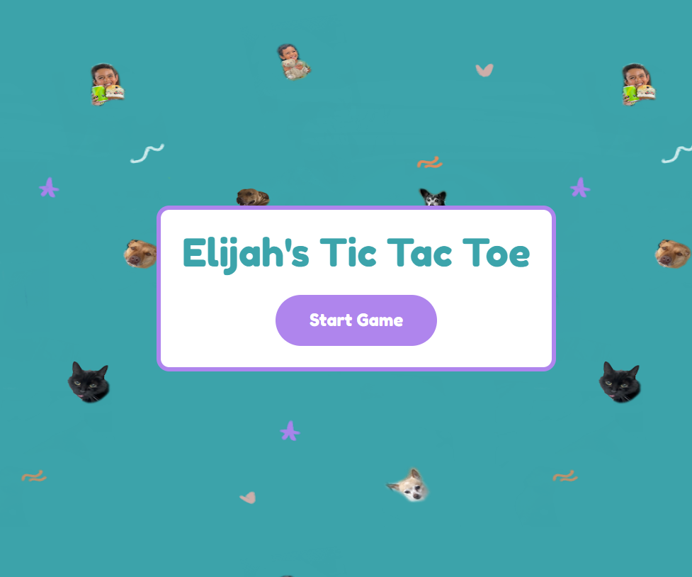
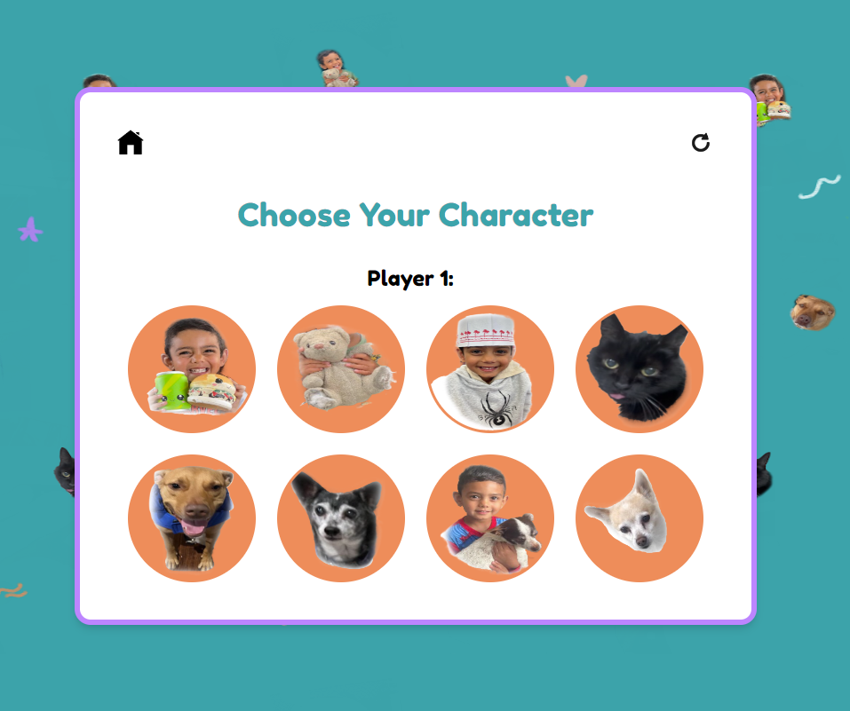
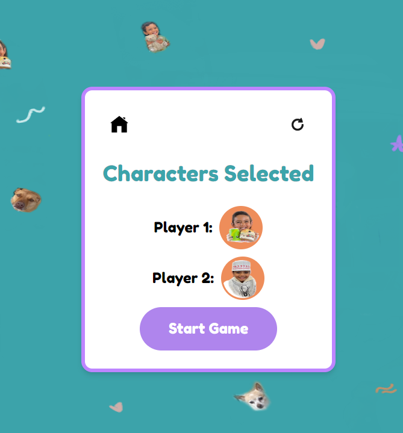
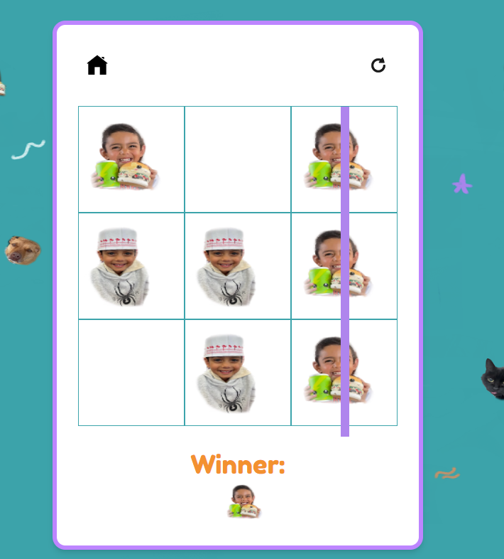

# Tic Tac Toe for Elijah (my nephew)   

View deployed project: https://priyakumar0817.github.io/tic-tac-toe-app/

This project makes use of:
- JavaScript
- HTML
- CSS

The tools and frameworks used are:
- React for building the user interface
- Tailwind CSS for styling
- PropTypes for type checking the props passed to components

Samples:  

This is a customized Tic Tac Toe game created for my nephew, Elijah. Features a customized design, personalized character selections, and animations, making the classic game more fun and engaging!